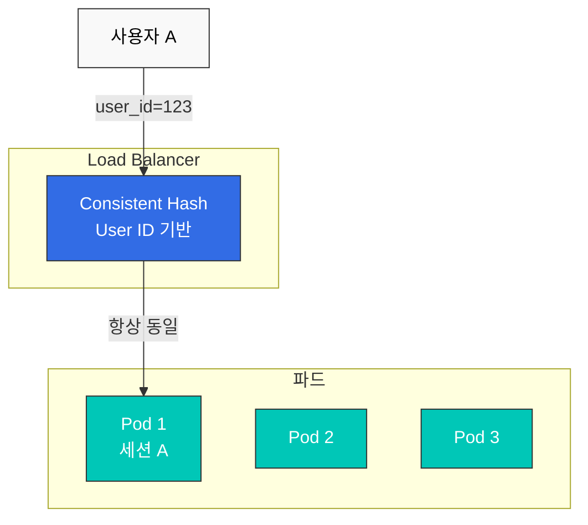

# Session Affinity

Session Affinity(또는 Sticky Session)는 동일한 사용자의 요청을 같은 파드로 라우팅하는 기법입니다.

## 목차

1. [Session Affinity 개요](#session-affinity-개요)
2. [Consistent Hash 기반](#consistent-hash-기반)
3. [Cookie 기반](#cookie-기반)
4. [Header 기반](#header-기반)
5. [실전 예제](#실전-예제)

## Session Affinity 개요



## Consistent Hash 기반

### HTTP Header 기반

```yaml
apiVersion: networking.istio.io/v1beta1
kind: DestinationRule
metadata:
  name: reviews-session-affinity
spec:
  host: reviews
  trafficPolicy:
    loadBalancer:
      consistentHash:
        httpHeaderName: "x-user-id"
```

### Cookie 기반

```yaml
apiVersion: networking.istio.io/v1beta1
kind: DestinationRule
metadata:
  name: reviews-cookie-affinity
spec:
  host: reviews
  trafficPolicy:
    loadBalancer:
      consistentHash:
        httpCookie:
          name: "session-id"
          ttl: 0s  # 쿠키 만료 시간 (0s = 세션 쿠키)
```

### Source IP 기반

```yaml
apiVersion: networking.istio.io/v1beta1
kind: DestinationRule
metadata:
  name: reviews-ip-affinity
spec:
  host: reviews
  trafficPolicy:
    loadBalancer:
      consistentHash:
        useSourceIp: true
```

## 참고 자료

- [Istio Session Affinity](https://istio.io/latest/docs/reference/config/networking/destination-rule/#LoadBalancerSettings-ConsistentHashLB)
